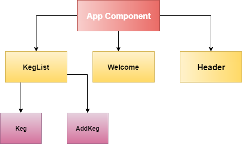

# Tap Room

This website allows user to view a list of kegs

### Components Tree

### User Story

#### User can view a list of kegs and check name, brand, price, alcohol content, amount left

* Input: User hover with their cursor
* Output: Display name, brand, price, alcohol content, amount left

## Setup
### Instructions:
In order for this project to work. First make sure you have **NodeJS** installed on your machine.

To install NodeJS visit [this link](https://nodejs.org/en/) and follow the installation step.

### In Terminal
```
$ cd Desktop
$ git clone https://github.com/JohnSawiris/tap-room-react
$ cd tap-room-react
$ npm install
```
This will install all the necessary packages for the project to work

### Bugs
_There's no known bugs_

#### Technologies Used
* ReactJS
* JSX
* CSS
* ES6


### License
Copyright (c) 2018 **John Sawiris** All Rights Reserved.

_This software is licensed under the MIT license._
